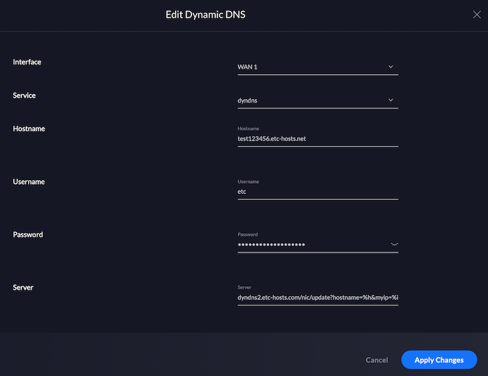

# How to configure UniFi Dream Machine
{: .no_toc }

To configure the UniFi Dream Machine to automatically update your host's IP, go to
settings (*Gateway > Dynamic DNS* or *Services > Dynamic DNS*) and add a new
service.

Set:

- *Service* to *dyndns*
- *Hostname* to your etc-hosts hostname
- *Username* to *etc*
- *Password* to your host's API key
- *Server * to *dyndns2.etc-hosts.com/nic/update?hostname=%h&myip=%i*

